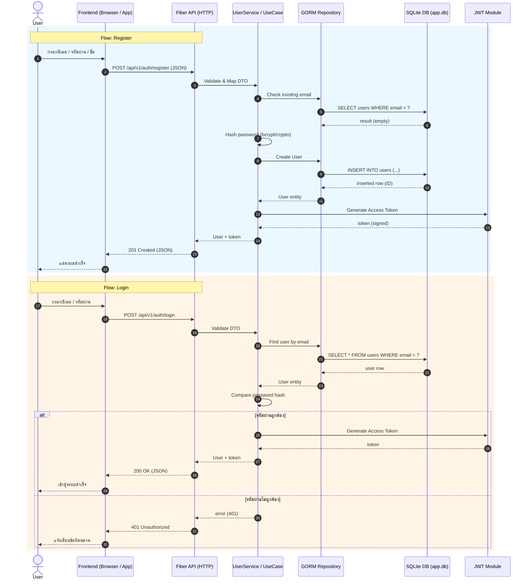
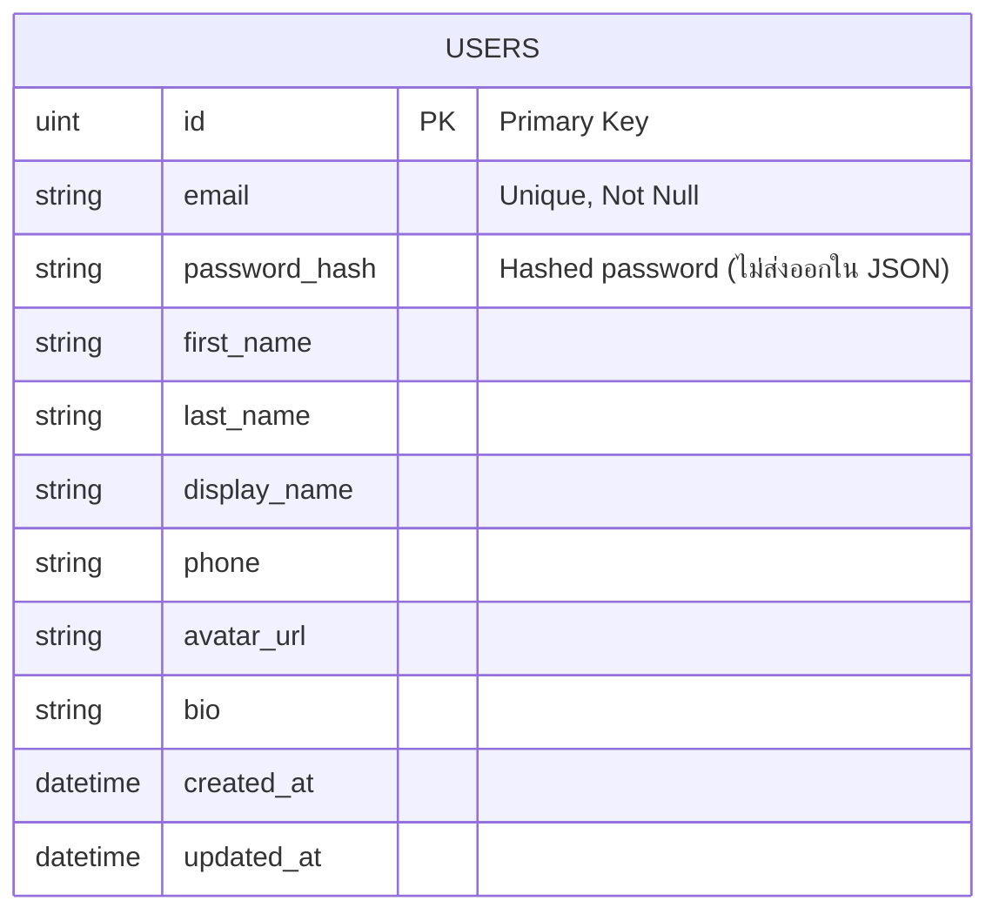

# System Detail Documentation

เอกสารนี้อธิบายลำดับการทำงาน (Sequence) ของการสมัครสมาชิกและเข้าสู่ระบบ พร้อมทั้ง ER Diagram (Mermaid) ของตารางผู้ใช้ (users)

## 1. Sequence Diagram: สมัครสมาชิก (Register) & เข้าสู่ระบบ (Login)

## 2. ER Diagram (Mermaid)

หมายเหตุ:
- ตารางที่มีอยู่ในโค้ดตอนนี้เห็นเพียงโครงสร้าง User (models/user.go)
- หากในอนาคตมีตารางอื่น (เช่น POSTS, ROLES, REFRESH_TOKENS) สามารถขยาย ER Diagram ได้โดยเพิ่มความสัมพันธ์ (|o--o{, ||--o{ ฯลฯ)

## 3. แนวคิดการขยาย (Future Extension)
- เพิ่มตาราง refresh_tokens เพื่อรองรับ refresh flow
- เพิ่มตาราง roles / permissions แล้วทำตาราง many-to-many (user_roles)
- จัดทำ index เพิ่มเติม: UNIQUE(email), INDEX(phone)

## 4. การรักษาความปลอดภัย
- Password เก็บเฉพาะ Hash (เช่น bcrypt / Argon2)
- JWT ควรมี expiration (เช่น 15m) และ secret เก็บใน environment variable
- ควรเพิ่ม middleware ตรวจสอบ JWT บนเส้นทางที่ต้องการ authentication

จบเอกสาร
